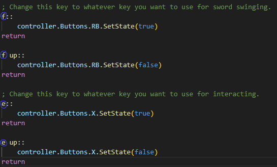
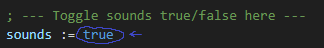
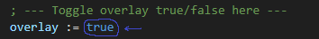

# post-descent

`rebind.ahk` is a macro that equalizes controls between Console and PC, rebinding sword swing and interact to controller inputs.  
`revive.ahk` is a macro that will automatically revive after a delay while emulating controller to sword swing forward. It is **not** RTA-legal.

---

## Setup

1. [Download the repository as a ZIP by clicking **Code → Download ZIP** on GitHub.](https://github.com/Alice42069/post-descent/archive/refs/heads/main.zip)
2. Right-click the ZIP, select **Properties**, then check the **Unblock** checkbox  
3. Unzip the ZIP to a location of your choice  
4. Run a script; this will install `ViGEmBus`  
5. If the script fails to run after installing:  
   - Make an antivirus exception for:  
     ```
     C:\Program Files\Nefarius Software Solutions\ViGEm Bus Driver
     ```  
   - Manually install [ViGEmBus](https://github.com/nefarius/ViGEmBus/releases)  

---

## Usage

### rebind.ahk

1. Press `5` to toggle  
2. Sword swing is bound to `F` by default  
3. Interact is bound to `E` by default  
4. Use the arrow keys or `IJKL` to look around (**do not use mouse!**)  
5. Press `5` again to restore normal keyboard functionality  


---

### revive.ahk

1. Press `5` when the animation for the airlock door finishes (right after the latch spins around and locks)  
2. Waste your super
3. Walk up to the player you want to revive and look at a wall  
4. Wait; they will be revived automatically
5. The macro will hold down `X` to revive and spam `RB` to sword  
6. Use the arrow keys or `IJKL` to look around (**do not use mouse!**)  
7. Swording will stop after `15` seconds  


---

## Configuration

To configure the macros, edit `rebind.ahk` or `revive.ahk` directly.

### Keybinds

- To change the toggle key, edit the following line:  


- To change the sword and interact keys, edit the following lines in `rebind.ahk`:  


---

---

### Sounds

- To toggle sounds, edit the following line:  


---

### Overlay

- To toggle overlay, edit the following line:  

